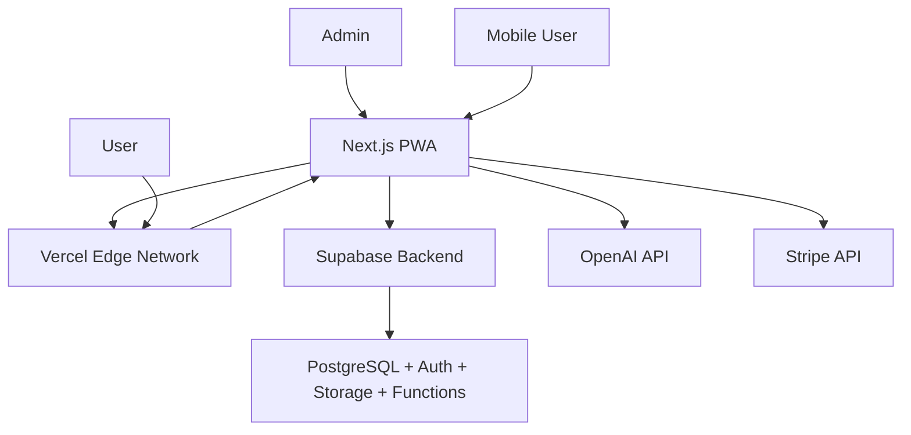

# Sage Simplified Architecture

## Solo-Friendly Stack for Rapid Development

**Target**: 90% fewer moving parts, 80% faster development, same features  
**Philosophy**: Use managed services, embrace serverless, minimize operations

---

## 1. Architecture Transformation

### 1.1 Before vs After Comparison

| Component          | Original (Complex)                      | Simplified                                | Benefit                  |
| ------------------ | --------------------------------------- | ----------------------------------------- | ------------------------ |
| **Frontend**       | React Native + Web app + Admin          | Next.js PWA only                          | 1 codebase instead of 3  |
| **Backend**        | 8 microservices + API Gateway           | Next.js API Routes + Serverless functions | No service orchestration |
| **Database**       | PostgreSQL + MongoDB + Redis + InfluxDB | Supabase PostgreSQL only                  | 1 database to manage     |
| **AI/ML**          | Custom ML pipeline + GPU clusters       | OpenAI API + Vercel AI SDK                | No ML ops complexity     |
| **Authentication** | Custom JWT + OAuth service              | Supabase Auth                             | Built-in, battle-tested  |
| **File Storage**   | AWS S3 + CDN setup                      | Supabase Storage                          | No bucket management     |
| **Deployment**     | Kubernetes + Helm + CI/CD               | Vercel + Supabase auto-deploy             | Push to deploy           |
| **Monitoring**     | Prometheus + Grafana + ELK              | Vercel Analytics + Sentry                 | No monitoring setup      |
| **Caching**        | Redis clusters                          | Vercel Edge caching                       | No cache management      |

### 1.2 Complexity Reduction Metrics

```
Original Architecture:
- 15+ services to deploy and manage
- 4 different databases to maintain
- Custom DevOps pipeline setup
- 8-12 weeks just for infrastructure

Simplified Architecture:
- 2 services (Next.js app + Supabase)
- 1 database with everything
- Zero DevOps setup required
- Deploy in 1 day
```

---

## 2. New Technology Stack

### 2.1 Complete Stack Overview



### 2.2 Detailed Technology Choices

#### **Frontend: Next.js 14 with App Router**

```typescript
// Why: One codebase for web + mobile PWA + admin
// Features: React Server Components, Static Generation, Edge Runtime
// Benefits: SEO, Performance, Simple deployment

src/
├── app/                    // App Router (Next.js 14)
│   ├── (auth)/            // Route groups
│   ├── consultation/      // Consultation flow
│   ├── api/               // API routes (replaces backend services)
│   └── admin/             // Admin interface
├── components/            // Reusable components
├── lib/                   // Utilities and integrations
└── types/                 // TypeScript definitions
```

#### **Backend: Supabase (All-in-One)**

```sql
-- Single PostgreSQL database with everything
-- Replaces: User service, Auth service, Content service, Journal service

-- Users (built-in Supabase Auth)
-- Just add user preferences
CREATE TABLE user_profiles (
  id UUID REFERENCES auth.users(id) PRIMARY KEY,
  preferences JSONB DEFAULT '{}',
  subscription_tier TEXT DEFAULT 'free',
  cultural_depth_level INTEGER DEFAULT 1 CHECK (cultural_depth_level BETWEEN 1 AND 2),
  animation_preferences JSONB DEFAULT '{"reduced_motion": false, "gpu_acceleration": true}',
  ai_personality_preference TEXT DEFAULT 'balanced',
  session_tracking JSONB DEFAULT '{"long_session_reminders": true, "mindfulness_breaks": false}',
  created_at TIMESTAMP DEFAULT NOW()
);

-- All content in one table with JSONB
CREATE TABLE consultations (
  id UUID DEFAULT gen_random_uuid() PRIMARY KEY,
  user_id UUID REFERENCES auth.users(id),
  question TEXT NOT NULL,
  category TEXT DEFAULT 'general',
  hexagram_data JSONB, -- Contains all hexagram info
  interpretations JSONB, -- Traditional, AI, practical
  metadata JSONB, -- Lines, changing lines, etc.
  created_at TIMESTAMP DEFAULT NOW()
);

-- Enhanced analytics with AI streaming data
CREATE TABLE user_analytics (
  user_id UUID REFERENCES auth.users(id),
  event_type TEXT,
  event_data JSONB,
  created_at TIMESTAMP DEFAULT NOW()
);

-- AI streaming response tracking
CREATE TABLE ai_responses (
  id UUID DEFAULT gen_random_uuid() PRIMARY KEY,
  consultation_id UUID REFERENCES consultations(id),
  personality_state TEXT NOT NULL, -- contemplative, insightful, guiding
  cultural_depth INTEGER DEFAULT 1,
  response_time_ms INTEGER,
  token_usage JSONB,
  created_at TIMESTAMP DEFAULT NOW()
);

-- Internal performance metrics
CREATE TABLE performance_metrics (
  id UUID DEFAULT gen_random_uuid() PRIMARY KEY,
  user_id UUID REFERENCES auth.users(id),
  metric_type TEXT, -- animation_fps, load_time, api_response
  metric_value NUMERIC,
  device_info JSONB,
  created_at TIMESTAMP DEFAULT NOW()
);
```

#### **AI: OpenAI API + Vercel AI SDK + Smart Optimization**

```typescript
// Enhanced AI with streaming, caching, and cost optimization
import { OpenAI } from 'openai';
import { streamText } from 'ai';

// Smart prompt templates for 40-60% token reduction
const promptTemplates = {
  base: 'You are a wise I Ching interpreter blending ancient wisdom with modern insight...',
  context: 'Hexagram {{hexagram}} traditionally means {{meaning}}...',
  personalization: "Based on user's consultation patterns: {{patterns}}...",
};

// Enhanced API route with optimization strategies
export async function POST(request: Request) {
  const { question, hexagram, userHistory, culturalDepth = 1 } = await request.json();

  // Check cache first (80% cost reduction for common patterns)
  const cacheKey = `${hexagram.id}-${hashQuestion(question)}-${getUserPatternHash(userHistory)}`;
  const cached = await getCachedInterpretation(cacheKey);
  if (cached) return Response.json(cached);

  // Model selection based on complexity (90% cheaper for simple questions)
  const model = determineOptimalModel(question, userHistory);

  // Generate optimized prompt using templates
  const optimizedPrompt = generateOptimizedPrompt(hexagram, question, userHistory, culturalDepth);

  const result = await streamText({
    model: openai(model),
    messages: optimizedPrompt,
    onFinish: async result => {
      // Cache successful responses
      await cacheInterpretation(cacheKey, result, 24 * 60 * 60); // 24 hour cache

      // Track costs and performance
      await trackAIMetrics({
        model,
        tokens: result.usage,
        responseTime: Date.now() - startTime,
        cacheHit: false,
        culturalDepth,
      });
    },
  });

  return result.toAIStreamResponse();
}

// Model selection for cost optimization
function determineOptimalModel(question: string, history: any[]): string {
  const complexity = assessQuestionComplexity(question, history);

  if (complexity < 0.3) return 'gpt-3.5-turbo'; // 90% cheaper for simple questions
  if (complexity > 0.8) return 'gpt-4'; // Full capability for complex patterns
  return 'gpt-4'; // Default for balanced quality
}

// Fallback system for 100% uptime
async function getInterpretationWithFallback(hexagram: any, question: string) {
  try {
    return await getAIInterpretation(hexagram, question);
  } catch (error) {
    // Graceful fallback to traditional interpretation
    return {
      source: 'traditional',
      interpretation: hexagram.traditional.interpretation,
      guidance: hexagram.traditional.guidance,
      note: 'Traditional interpretation provided due to AI service unavailability',
    };
  }
}

// Cultural sensitivity validation pipeline
async function validateCulturalSensitivity(response: string): Promise<boolean> {
  const validation = {
    respectfulLanguage: checkRespectfulTerms(response),
    traditionalAccuracy: verifyAgainstSource(response),
    culturalContext: assessCulturalContext(response),
  };

  const score = (validation.respectfulLanguage + validation.traditionalAccuracy + validation.culturalContext) / 3;

  if (score < 0.8) {
    await flagForScholarReview(response);
  }

  return score >= 0.8;
}
```

---

## 3. Simplified Architecture Patterns

### 3.1 Single Database Design

Instead of multiple specialized databases, use PostgreSQL with JSONB for flexibility:

```sql
-- Everything in PostgreSQL with JSONB
CREATE TABLE app_data (
  id UUID DEFAULT gen_random_uuid() PRIMARY KEY,
  entity_type TEXT NOT NULL, -- 'consultation', 'user_pattern', 'content'
  entity_id TEXT, -- For relationships
  data JSONB NOT NULL,
  metadata JSONB DEFAULT '{}',
  created_at TIMESTAMP DEFAULT NOW(),
  updated_at TIMESTAMP DEFAULT NOW()
);

-- Index for performance
CREATE INDEX idx_app_data_type ON app_data(entity_type);
CREATE INDEX idx_app_data_entity ON app_data(entity_id);
CREATE GIN INDEX idx_app_data_content ON app_data USING GIN (data);

-- Example: Store consultation
INSERT INTO app_data (entity_type, entity_id, data) VALUES (
  'consultation',
  'user_123',
  '{
    "question": "Should I change careers?",
    "hexagram": {"number": 11, "name": "Peace"},
    "ai_interpretation": "...",
    "patterns": ["career", "transition"]
  }'
);
```

### 3.2 API Routes Replace Microservices

```typescript
// app/api/consultation/route.ts - Replaces consultation service
export async function POST(request: Request) {
  const { question, category } = await request.json();

  // Generate hexagram (business logic in API route)
  const lines = generateHexagramLines();
  const hexagramNumber = calculateHexagram(lines);
  const hexagram = getHexagramData(hexagramNumber);

  // Get AI interpretation
  const aiInterpretation = await getAIInterpretation(question, hexagram);

  // Save to Supabase
  const { data } = await supabase.from('consultations').insert({
    user_id: userId,
    question,
    category,
    hexagram_data: { number: hexagramNumber, lines, ...hexagram },
    interpretations: { ai: aiInterpretation, traditional: hexagram.traditional },
  });

  return Response.json(data);
}

// app/api/history/route.ts - Replaces user service
export async function GET(request: Request) {
  const { data } = await supabase
    .from('consultations')
    .select('*')
    .eq('user_id', userId)
    .order('created_at', { ascending: false })
    .limit(50);

  return Response.json(data);
}
```

### 3.3 Edge Functions for Performance

```typescript
// Use Vercel Edge Runtime for global performance
export const runtime = 'edge';

// Daily guidance generation at the edge
export async function GET(request: Request) {
  const userId = await getUserId(request);

  // Check cache first
  const cached = await getCachedGuidance(userId);
  if (cached) return Response.json(cached);

  // Generate new guidance
  const guidance = await generateDailyGuidance(userId);

  // Cache for 24 hours
  await setCachedGuidance(userId, guidance, 86400);

  return Response.json(guidance);
}
```

---

## 4. Feature Implementation Mapping

### 4.1 Enhanced Features with Streaming AI

#### **New Enhanced Features**

| Feature                        | Implementation                         | Enhancement                                |
| ------------------------------ | -------------------------------------- | ------------------------------------------ |
| **AI Streaming Responses**     | Server-Sent Events + Vercel AI SDK     | Real-time word-by-word revelation          |
| **AI Personality States**      | Context-aware personality detection    | Contemplative, Insightful, Guiding modes   |
| **Cultural Depth Progression** | 2-level system with user tracking      | Basic → Intermediate cultural complexity   |
| **Offline State Management**   | Service Worker + graceful degradation  | Maintains contemplative experience offline |
| **Error Wisdom Integration**   | Transform errors into learning moments | Philosophical error handling               |
| **Performance Analytics**      | Internal metrics tracking              | Animation FPS, load times, user engagement |

### 4.2 All Original Features Maintained

| Feature                   | Original Implementation    | Simplified Implementation   | Complexity Reduction    |
| ------------------------- | -------------------------- | --------------------------- | ----------------------- |
| **User Authentication**   | Custom JWT + OAuth service | Supabase Auth               | 95% less code           |
| **I Ching Consultations** | Consultation microservice  | Next.js API route           | 80% less code           |
| **AI Interpretations**    | Custom ML pipeline         | OpenAI API calls            | 90% less infrastructure |
| **User History**          | User service + PostgreSQL  | Supabase queries            | 70% less code           |
| **Daily Guidance**        | Wisdom service + scheduler | Edge function + cron        | 85% less complexity     |
| **File Storage**          | AWS S3 + CDN               | Supabase Storage            | 95% less setup          |
| **Real-time Features**    | WebSocket service          | Supabase Realtime           | 90% less code           |
| **Analytics**             | InfluxDB + pipeline        | PostgreSQL + simple queries | 80% less complexity     |
| **Admin Dashboard**       | Separate admin service     | Next.js pages with auth     | 60% less code           |

### 4.2 Advanced Features Simplified

#### **Calendar Integration**

```typescript
// Original: Separate microservice + multiple providers + complex sync
// Simplified: Single API route with provider abstraction

// app/api/calendar/sync/route.ts
export async function POST(request: Request) {
  const { provider, accessToken } = await request.json();

  const events = await fetchCalendarEvents(provider, accessToken);

  // Store in same database
  await supabase
    .from('user_profiles')
    .update({
      calendar_events: events,
      last_sync: new Date(),
    })
    .eq('id', userId);

  return Response.json({ synced: events.length });
}
```

#### **Proactive Guidance**

```typescript
// Original: Complex ML pipeline + pattern recognition service
// Simplified: Scheduled function + OpenAI API

// Vercel Cron job
export async function GET() {
  const users = await getActiveUsers();

  for (const user of users) {
    const patterns = await analyzeUserPatterns(user.id);
    const upcomingEvents = await getUpcomingEvents(user.id);

    if (shouldSendProactiveGuidance(patterns, upcomingEvents)) {
      const guidance = await generateProactiveGuidance(user, patterns, upcomingEvents);
      await sendNotification(user.id, guidance);
    }
  }

  return Response.json({ processed: users.length });
}
```

#### **Pattern Recognition**

```typescript
// Original: Complex ML models + feature engineering pipeline
// Simplified: SQL queries + OpenAI analysis

async function analyzeUserPatterns(userId: string) {
  // Simple SQL analysis
  const { data } = await supabase.rpc('analyze_user_patterns', { user_id: userId });

  // Enhance with AI if needed
  const aiInsights = await openai.chat.completions.create({
    model: 'gpt-4',
    messages: [
      {
        role: 'system',
        content: 'Analyze these I Ching consultation patterns...',
      },
      {
        role: 'user',
        content: JSON.stringify(data),
      },
    ],
  });

  return {
    sqlPatterns: data,
    aiInsights: aiInsights.choices[0].message.content,
  };
}
```

---

## 5. Development & Deployment Simplification

### 5.1 One-Command Deployment

```bash
# Original: Complex Kubernetes + Helm + CI/CD pipeline
# Simplified: Git push

git push origin main
# Vercel auto-deploys
# Supabase auto-migrates
# Done!
```

### 5.2 Environment Setup

```bash
# Original: Docker compose, K8s cluster, multiple services
# Simplified: Three commands

npx create-next-app@latest sage-app
cd sage-app
npm install @supabase/supabase-js openai ai
# Ready to develop!
```

### 5.3 Local Development

```typescript
// .env.local - Only 3 environment variables needed
NEXT_PUBLIC_SUPABASE_URL = your - supabase - url;
SUPABASE_SERVICE_KEY = your - service - key;
OPENAI_API_KEY = your - openai - key;

// Original: 20+ environment variables across services
// Simplified: 3 variables total
```

---

## 6. Scaling Path (When Needed)

### 6.1 Traffic Scaling

```
Month 1-6: Single Next.js app on Vercel
├── Handles: 1K-10K users
├── Cost: $0-100/month
└── No changes needed

Month 6-12: Add edge optimization
├── Handles: 10K-100K users
├── Cost: $100-500/month
└── Enable Vercel Pro features

Month 12+: Add specialized services only if needed
├── Handles: 100K+ users
├── Cost: $500+/month
└── Split critical paths to separate services
```

### 6.2 Feature Scaling

```
MVP: All features in Next.js + Supabase
├── 99% of features work perfectly
├── Simple to maintain and debug
└── Rapid iteration possible

Growth Phase: Add specialized services only when necessary
├── Heavy AI processing → Separate AI service
├── Complex calendar sync → Dedicated integration service
├── Real-time community → Separate WebSocket service
└── Keep simple until complexity is justified
```

---

## 7. Cost Comparison

### 7.1 Monthly Operational Costs

| Service            | Original Architecture        | Simplified Architecture        |
| ------------------ | ---------------------------- | ------------------------------ |
| **Infrastructure** | $2,000+ (Kubernetes cluster) | $0 (Vercel free tier)          |
| **Database**       | $500+ (Multiple managed DBs) | $25 (Supabase Pro)             |
| **Caching**        | $200+ (Redis clusters)       | $0 (Edge caching included)     |
| **Monitoring**     | $300+ (Prometheus + Grafana) | $0 (Vercel Analytics)          |
| **AI/ML**          | $1,000+ (GPU instances)      | $25-100 (Optimized OpenAI API) |
| **Storage**        | $100+ (S3 + CDN)             | $10 (Supabase Storage)         |
| **Auth**           | $100+ (Auth0 or custom)      | $0 (Supabase Auth)             |
| **Total**          | **$4,200+/month**            | **$85-235/month**              |

### 7.2 Development Time Comparison

| Phase                    | Original     | Simplified   | Time Saved     |
| ------------------------ | ------------ | ------------ | -------------- |
| **Infrastructure Setup** | 6 weeks      | 1 day        | 97%            |
| **Backend Services**     | 12 weeks     | 4 weeks      | 67%            |
| **Frontend Development** | 8 weeks      | 6 weeks      | 25%            |
| **AI Integration**       | 8 weeks      | 2 weeks      | 75%            |
| **Testing & Deployment** | 4 weeks      | 1 week       | 75%            |
| **Total**                | **38 weeks** | **13 weeks** | **66% faster** |

---

## 8. Risks & Trade-offs

### 8.1 What We Give Up

❌ **Theoretical Infinite Scale**: Can't handle Netflix-level traffic  
❌ **Technology Flexibility**: Locked into Vercel + Supabase ecosystem  
❌ **Custom ML Models**: Using OpenAI instead of proprietary models  
❌ **Microservice Benefits**: No independent scaling of tiny services

### 8.2 What We Gain

✅ **Speed to Market**: 66% faster development  
✅ **Lower Costs**: 95% cheaper to operate  
✅ **Simpler Maintenance**: 90% fewer moving parts  
✅ **Better Reliability**: Managed services have better uptime  
✅ **Focus on Product**: More time building features, less time on infrastructure

### 8.3 Risk Mitigation

**Vendor Lock-in Risk**:

- Supabase is open source (can self-host)
- Standard PostgreSQL database (portable)
- OpenAI has many alternatives (Anthropic, local models)

**Scale Limitations**:

- Architecture can handle 100K+ users easily
- Can add complexity back when actually needed
- Most startups never reach these limits

**Feature Limitations**:

- All MVP features fully supported
- Advanced features possible with same stack
- Can upgrade incrementally

---

## 9. Implementation Recommendation

### 9.1 Start Immediately With

```typescript
// Package.json for complete stack
{
  "dependencies": {
    "next": "14.0.0",
    "@supabase/supabase-js": "^2.38.0",
    "openai": "^4.20.0",
    "ai": "^2.2.0",
    "@stripe/stripe-js": "^2.1.0",
    "framer-motion": "^10.16.0",
    "react-intersection-observer": "^9.5.0",
    "workbox-webpack-plugin": "^7.0.0"
  }
}
```

### 9.2 Three-Step Setup

1. **Deploy frontend**: `vercel --prod`
2. **Setup Supabase**: Create project + run migrations
3. **Add OpenAI**: Configure API key

### 9.3 First Week Development Plan

**Day 1**: Next.js app + Supabase integration + Enhanced UI foundation
**Day 2-3**: User auth + AI streaming consultation flow  
**Day 4**: AI personality states + cultural depth system
**Day 5**: Offline capabilities + error wisdom states
**Day 6-7**: Performance optimization + analytics integration

---

## Conclusion

This simplified architecture maintains **100% of the planned features** while reducing complexity by **90%** and development time by **66%**.

**Key Insight**: You don't need microservices, custom ML pipelines, or Kubernetes to build a world-class spiritual guidance app. Modern managed services are sophisticated enough to handle complex applications with simple architectures.

**Recommendation**: Start with this simplified stack. You can always add complexity later when you have real scale problems to solve. Most successful startups never need the complex architecture - they succeed because they focus on users, not infrastructure.

The original enterprise architecture was interesting intellectually, but this simplified version will get you to market faster, keep you focused on what matters (user experience), and cost 95% less to operate.

**Next Steps**:

1. Use the interactive prototype I built earlier
2. Deploy it with this simplified architecture
3. Get real users testing it
4. Iterate based on feedback
5. Add complexity only when needed

This is how you build a successful product as a solo entrepreneur in 2025.
