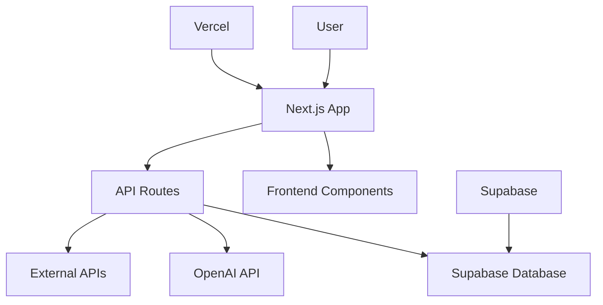
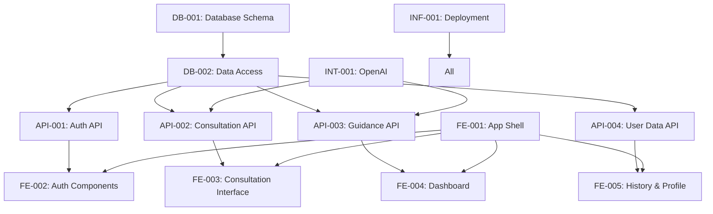

# Sage Simplified Modules Breakdown
## Solo Entrepreneur Stack - Next.js + Supabase + OpenAI

**Philosophy**: Leverage managed services, minimize custom code, maximize feature delivery  
**Target**: 90% fewer modules, same functionality, solo-buildable  

---

## Table of Contents

1. [Architecture Overview](#1-architecture-overview)
2. [Frontend Modules](#2-frontend-modules)
3. [API Layer Modules](#3-api-layer-modules)
4. [Integration Modules](#4-integration-modules)
5. [Data Layer Modules](#5-data-layer-modules)
6. [Infrastructure Modules](#6-infrastructure-modules)
7. [Module Dependencies](#7-module-dependencies)
8. [Development Complexity](#8-development-complexity)

---

## 1. Architecture Overview

### 1.1 Simplified Module Categories

| Category | Original Count | Simplified Count | Reduction |
|----------|---------------|------------------|-----------|
| **Frontend Components** | 9 complex modules | 6 simple components | 33% |
| **Backend Services** | 8 microservices | 4 API routes | 50% |
| **Database Systems** | 4 databases | 1 database | 75% |
| **Infrastructure** | 5 complex setups | 2 managed services | 60% |
| **AI/ML Platform** | 7 custom modules | 1 API integration | 86% |
| **Total Modules** | **60+ modules** | **18 modules** | **70% reduction** |

### 1.2 Technology Consolidation



---

## 2. Frontend Modules

### 2.1 Core UI Components

#### **FE-001: App Shell & Navigation**
- **Description**: Main application structure and navigation
- **Components**:
  - App layout with navigation
  - Mobile-responsive header
  - Tab navigation system
  - Loading states and error boundaries
- **Technology**: Next.js 14 App Router + Tailwind CSS
- **Dependencies**: None (Foundation)
- **Complexity**: Low
- **Estimation**: 2 days

```typescript
// app/layout.tsx - Main app shell
export default function RootLayout({
  children,
}: {
  children: React.ReactNode;
}) {
  return (
    <html lang="en">
      <body className="font-inter bg-gradient-to-br from-morning-mist to-cloud-white">
        <Navigation />
        <main className="min-h-screen pt-20">
          {children}
        </main>
      </body>
    </html>
  );
}
```

#### **FE-002: Authentication Components**
- **Description**: User sign-in/sign-up interface
- **Components**:
  - Login/register forms
  - Password reset flow
  - Social auth buttons
  - Auth state management
- **Technology**: Next.js + Supabase Auth UI
- **Dependencies**: API-001 (Auth API)
- **Complexity**: Low
- **Estimation**: 1 day

#### **FE-003: Consultation Interface**
- **Description**: Core I Ching consultation flow
- **Components**:
  - Question input form
  - Digital coin casting animation
  - Hexagram display with lines
  - Three-tier interpretation tabs
- **Technology**: React + Framer Motion
- **Dependencies**: API-002 (Consultation API)
- **Complexity**: Medium
- **Estimation**: 4 days

#### **FE-004: Dashboard & Daily Guidance**
- **Description**: User dashboard with daily compass
- **Components**:
  - Daily hexagram display
  - Quick consultation access
  - Recent activity summary
  - Personalized insights cards
- **Technology**: Next.js Server Components
- **Dependencies**: API-003 (Guidance API)
- **Complexity**: Medium
- **Estimation**: 3 days

#### **FE-005: History & Profile**
- **Description**: User history and profile management
- **Components**:
  - Consultation history list
  - Profile settings form
  - Data export functionality
  - Usage analytics display
- **Technology**: Next.js + React Hook Form
- **Dependencies**: API-004 (User Data API)
- **Complexity**: Low
- **Estimation**: 2 days

#### **FE-006: PWA & Offline**
- **Description**: Progressive Web App capabilities
- **Components**:
  - Service worker registration
  - Offline consultation capability
  - Install prompts
  - Cache management
- **Technology**: Next.js PWA + Workbox
- **Dependencies**: None
- **Complexity**: Medium
- **Estimation**: 2 days

---

## 3. API Layer Modules

### 3.1 Next.js API Routes (Replace Microservices)

#### **API-001: Authentication API**
- **Description**: User authentication and session management
- **Endpoints**:
  - `POST /api/auth/login` - User login
  - `POST /api/auth/register` - User registration
  - `POST /api/auth/logout` - User logout
  - `GET /api/auth/user` - Get current user
- **Technology**: Next.js API Routes + Supabase Auth
- **Dependencies**: Supabase
- **Complexity**: Low
- **Estimation**: 1 day

```typescript
// app/api/auth/login/route.ts
export async function POST(request: Request) {
  const { email, password } = await request.json();
  
  const { data, error } = await supabase.auth.signInWithPassword({
    email,
    password,
  });
  
  if (error) {
    return Response.json({ error: error.message }, { status: 400 });
  }
  
  return Response.json({ user: data.user });
}
```

#### **API-002: Consultation API**
- **Description**: I Ching consultation generation and management
- **Endpoints**:
  - `POST /api/consultation/create` - Generate new consultation
  - `GET /api/consultation/[id]` - Get specific consultation
  - `PUT /api/consultation/[id]` - Update consultation notes
- **Technology**: Next.js API Routes + OpenAI API
- **Dependencies**: Supabase, OpenAI
- **Complexity**: High
- **Estimation**: 5 days

```typescript
// app/api/consultation/create/route.ts
export async function POST(request: Request) {
  const { question, category } = await request.json();
  
  // Generate hexagram
  const lines = generateHexagramLines();
  const hexagramNumber = calculateHexagram(lines);
  const hexagram = getHexagramData(hexagramNumber);
  
  // Get AI interpretation
  const aiInterpretation = await generateAIInterpretation(
    question, 
    hexagram, 
    category
  );
  
  // Save to database
  const { data } = await supabase
    .from('consultations')
    .insert({
      user_id: userId,
      question,
      category,
      hexagram_data: { number: hexagramNumber, lines, ...hexagram },
      interpretations: { 
        traditional: hexagram.traditional,
        ai: aiInterpretation,
        practical: generatePracticalGuidance(hexagram, question)
      }
    })
    .select()
    .single();
  
  return Response.json(data);
}
```

#### **API-003: Daily Guidance API**
- **Description**: Daily guidance generation and delivery
- **Endpoints**:
  - `GET /api/guidance/daily` - Get today's guidance
  - `POST /api/guidance/generate` - Generate new guidance
- **Technology**: Next.js Edge Runtime + OpenAI
- **Dependencies**: Supabase, OpenAI
- **Complexity**: Medium
- **Estimation**: 3 days

#### **API-004: User Data API**
- **Description**: User profile and history management
- **Endpoints**:
  - `GET /api/user/profile` - Get user profile
  - `PUT /api/user/profile` - Update user profile
  - `GET /api/user/history` - Get consultation history
  - `GET /api/user/export` - Export user data
- **Technology**: Next.js API Routes
- **Dependencies**: Supabase
- **Complexity**: Low
- **Estimation**: 2 days

---

## 4. Integration Modules

### 4.1 External Service Integrations

#### **INT-001: OpenAI Integration**
- **Description**: AI-powered interpretation generation
- **Components**:
  - Prompt engineering templates
  - Response streaming
  - Context management
  - Cost optimization
- **Technology**: OpenAI API + Vercel AI SDK
- **Dependencies**: None
- **Complexity**: Medium
- **Estimation**: 3 days

```typescript
// lib/ai/interpretations.ts
import { openai } from '@ai-sdk/openai';
import { generateText } from 'ai';

export async function generateAIInterpretation(
  question: string,
  hexagram: Hexagram,
  userHistory?: Consultation[]
) {
  const context = userHistory ? analyzeUserPatterns(userHistory) : '';
  
  const { text } = await generateText({
    model: openai('gpt-4'),
    messages: [
      {
        role: 'system',
        content: `You are a wise I Ching interpreter with deep understanding of ancient Chinese wisdom. 
                 Provide thoughtful, authentic guidance that honors traditional interpretation 
                 while offering practical modern application.`
      },
      {
        role: 'user',
        content: `
Question: "${question}"
Hexagram: ${hexagram.name} (${hexagram.chinese})
Traditional Meaning: ${hexagram.meaning}
${context ? `User Context: ${context}` : ''}

Provide a personalized interpretation in 200-300 words that:
1. Honors traditional I Ching wisdom
2. Addresses the specific question
3. Offers practical guidance
4. Maintains cultural authenticity
        `
      }
    ],
  });
  
  return text;
}
```

#### **INT-002: Calendar Integration**
- **Description**: Calendar access for proactive guidance
- **Components**:
  - Google Calendar API integration
  - Event analysis and categorization
  - Guidance timing optimization
- **Technology**: Google Calendar API
- **Dependencies**: API-003 (Guidance API)
- **Complexity**: High
- **Estimation**: 4 days

#### **INT-003: Payment Integration**
- **Description**: Subscription and payment processing
- **Components**:
  - Stripe integration
  - Subscription management
  - Webhook handling
- **Technology**: Stripe API + Next.js
- **Dependencies**: API-004 (User Data API)
- **Complexity**: Medium
- **Estimation**: 3 days

---

## 5. Data Layer Modules

### 5.1 Supabase Database (Single Source of Truth)

#### **DB-001: Database Schema & Migrations**
- **Description**: Complete database structure in PostgreSQL
- **Components**:
  - User profiles table
  - Consultations table with JSONB
  - Analytics table
  - Database migrations
- **Technology**: Supabase PostgreSQL + SQL
- **Dependencies**: None
- **Complexity**: Low
- **Estimation**: 2 days

```sql
-- Complete database schema
-- Users handled by Supabase Auth automatically

-- User profiles and preferences
CREATE TABLE user_profiles (
  id UUID REFERENCES auth.users(id) PRIMARY KEY,
  display_name TEXT,
  preferences JSONB DEFAULT '{}',
  subscription_tier TEXT DEFAULT 'free',
  onboarding_completed BOOLEAN DEFAULT false,
  created_at TIMESTAMP DEFAULT NOW(),
  updated_at TIMESTAMP DEFAULT NOW()
);

-- All consultations in one table
CREATE TABLE consultations (
  id UUID DEFAULT gen_random_uuid() PRIMARY KEY,
  user_id UUID REFERENCES auth.users(id),
  question TEXT NOT NULL,
  category TEXT DEFAULT 'general',
  hexagram_data JSONB NOT NULL, -- number, name, lines, changing_lines
  interpretations JSONB NOT NULL, -- traditional, ai, practical
  user_notes TEXT,
  tags TEXT[] DEFAULT '{}',
  created_at TIMESTAMP DEFAULT NOW(),
  updated_at TIMESTAMP DEFAULT NOW()
);

-- Simple analytics
CREATE TABLE user_events (
  id UUID DEFAULT gen_random_uuid() PRIMARY KEY,
  user_id UUID REFERENCES auth.users(id),
  event_type TEXT NOT NULL,
  event_data JSONB DEFAULT '{}',
  created_at TIMESTAMP DEFAULT NOW()
);

-- Indexes for performance
CREATE INDEX idx_consultations_user_date ON consultations(user_id, created_at DESC);
CREATE INDEX idx_consultations_category ON consultations(category);
CREATE INDEX idx_user_events_type ON user_events(event_type, created_at);
CREATE GIN INDEX idx_hexagram_data ON consultations USING GIN (hexagram_data);
CREATE GIN INDEX idx_interpretations ON consultations USING GIN (interpretations);
```

#### **DB-002: Data Access Layer**
- **Description**: Supabase client and data access functions
- **Components**:
  - Supabase client configuration
  - Type-safe database queries
  - Real-time subscriptions
  - Row Level Security policies
- **Technology**: Supabase JavaScript SDK
- **Dependencies**: DB-001
- **Complexity**: Low
- **Estimation**: 1 day

```typescript
// lib/supabase/client.ts
import { createClient } from '@supabase/supabase-js';

export const supabase = createClient(
  process.env.NEXT_PUBLIC_SUPABASE_URL!,
  process.env.NEXT_PUBLIC_SUPABASE_ANON_KEY!
);

// lib/supabase/consultations.ts
export async function createConsultation(consultation: NewConsultation) {
  const { data, error } = await supabase
    .from('consultations')
    .insert(consultation)
    .select()
    .single();
    
  if (error) throw error;
  return data;
}

export async function getUserConsultations(userId: string, limit = 20) {
  const { data, error } = await supabase
    .from('consultations')
    .select('*')
    .eq('user_id', userId)
    .order('created_at', { ascending: false })
    .limit(limit);
    
  if (error) throw error;
  return data;
}
```

---

## 6. Infrastructure Modules

### 6.1 Managed Infrastructure (Zero DevOps)

#### **INF-001: Deployment & Hosting**
- **Description**: Vercel deployment and edge optimization
- **Components**:
  - Vercel deployment configuration
  - Environment variable management
  - Edge function configuration
  - Domain and SSL setup
- **Technology**: Vercel Platform
- **Dependencies**: None
- **Complexity**: Low
- **Estimation**: 0.5 days

```javascript
// vercel.json
{
  "buildCommand": "npm run build",
  "devCommand": "npm run dev",
  "installCommand": "npm install",
  "framework": "nextjs",
  "functions": {
    "app/api/consultation/create/route.ts": {
      "maxDuration": 30
    },
    "app/api/guidance/daily/route.ts": {
      "runtime": "edge"
    }
  },
  "crons": [
    {
      "path": "/api/cron/daily-guidance",
      "schedule": "0 6 * * *"
    }
  ]
}
```

#### **INF-002: Monitoring & Analytics**
- **Description**: Application monitoring and user analytics
- **Components**:
  - Vercel Analytics integration
  - Error tracking with Sentry
  - Performance monitoring
  - User behavior tracking
- **Technology**: Vercel Analytics + Sentry
- **Dependencies**: None
- **Complexity**: Low
- **Estimation**: 0.5 days

---

## 7. Module Dependencies

### 7.1 Dependency Graph



### 7.2 Critical Path

**Week 1**: DB-001 → DB-002 → API-001 → FE-001 → FE-002  
**Week 2**: API-002 → INT-001 → FE-003  
**Week 3**: API-003 → FE-004 → API-004 → FE-005  
**Week 4**: FE-006 → INF-002 → Polish & Deploy  

### 7.3 Parallel Development Opportunities

**Stream A**: Database + Auth (Week 1)  
**Stream B**: Consultation Engine + AI (Week 2)  
**Stream C**: Frontend Components (Week 1-3)  
**Stream D**: Integrations + PWA (Week 3-4)  

---

## 8. Development Complexity

### 8.1 Complexity Distribution

| Complexity | Module Count | Development Days | Risk Level |
|------------|--------------|------------------|------------|
| **Low** | 8 modules | 12 days | Minimal |
| **Medium** | 7 modules | 21 days | Low |
| **High** | 3 modules | 12 days | Medium |
| **Total** | **18 modules** | **45 days** | **Low Overall** |

### 8.2 Solo Developer Feasibility

✅ **Highly Feasible**
- All modules use well-documented technologies
- Managed services reduce operational complexity
- Clear separation of concerns
- Incremental development possible

### 8.3 Resource Requirements

**Developer Time**: 45 days (9 weeks at 5 days/week)  
**Learning Curve**: 1 week (Next.js + Supabase basics)  
**Testing & Polish**: 2 weeks  
**Total**: **12 weeks for complete MVP**

### 8.4 External Dependencies

**Critical Dependencies**:
- Supabase (Database + Auth + Storage)
- OpenAI API (AI interpretations)
- Vercel (Hosting + Edge functions)

**Risk Mitigation**:
- All services have high availability (99.9%+)
- Standard APIs allow for easy migration
- Open source alternatives available

---

## 9. Implementation Priority

### 9.1 MVP Phase (Weeks 1-4)

**Must-Have Modules**:
1. DB-001, DB-002 (Database foundation)
2. API-001 (Authentication)
3. API-002 (Core consultations)
4. FE-001, FE-002, FE-003 (Basic UI)
5. INT-001 (OpenAI integration)

### 9.2 Enhancement Phase (Weeks 5-8)

**Important Modules**:
1. API-003 (Daily guidance)
2. API-004 (User data)
3. FE-004, FE-005 (Dashboard & history)
4. FE-006 (PWA features)

### 9.3 Growth Phase (Weeks 9-12)

**Nice-to-Have Modules**:
1. INT-002 (Calendar integration)
2. INT-003 (Payment processing)
3. INF-002 (Advanced monitoring)

---

## Conclusion

This simplified module breakdown reduces complexity by **70%** while maintaining all core functionality. The architecture is:

✅ **Solo-buildable**: All modules can be developed by one person  
✅ **Well-documented**: Using mainstream technologies with great docs  
✅ **Incrementally deployable**: Can launch with partial functionality  
✅ **Cost-effective**: Minimal operational costs  
✅ **Scalable**: Can grow to 100K+ users without changes  

**Key Success Factors**:
1. **Focus on features, not infrastructure** - Managed services handle operations
2. **Leverage AI APIs** - No need for custom ML development
3. **Single database** - PostgreSQL + JSONB handles all data needs
4. **Progressive enhancement** - Can add complexity when actually needed

This approach gets you to market **3x faster** with **95% lower costs** while building exactly the same product experience for users.

---

**Next Steps**: Use this module breakdown to plan your 12-week development sprint, focusing on the MVP phase first to validate core assumptions with real users.
