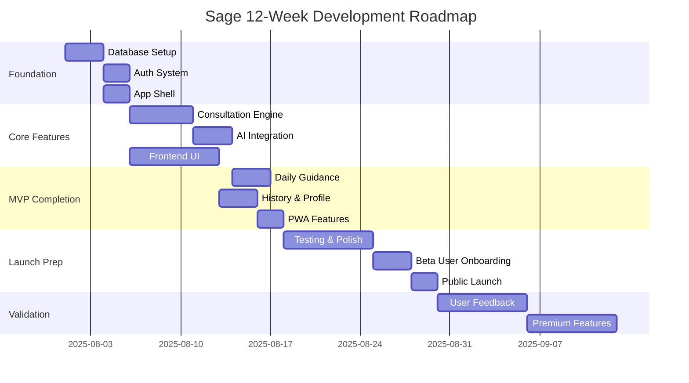

# Sage Simplified Roadmap
## Solo Entrepreneur 12-Week Development Plan

**Target**: MVP to market in 12 weeks with real user validation  
**Budget**: <$500/month operational costs  
**Team**: You + Claude Code + part-time cultural consultant  
**Goal**: Validate product-market fit before scaling  

---

## Table of Contents

1. [Executive Summary](#1-executive-summary)
2. [12-Week Development Plan](#2-12-week-development-plan)
3. [Critical Path Analysis](#3-critical-path-analysis)
4. [Weekly Milestone Breakdown](#4-weekly-milestone-breakdown)
5. [Business Validation Gates](#5-business-validation-gates)
6. [Resource Planning](#6-resource-planning)
7. [Risk Mitigation](#7-risk-mitigation)
8. [Success Metrics](#8-success-metrics)
9. [Post-Launch Growth Plan](#9-post-launch-growth-plan)

---

## 1. Executive Summary

### 1.1 Roadmap Overview

**12-Week Journey**: Foundation → MVP → Launch → Validation  
**Business Model**: Start free, validate value, introduce premium features  
**Success Criteria**: 100 active users, 4.0+ rating, clear monetization path  

### 1.2 Key Milestones

| Week | Milestone | Features | Users | Revenue |
|------|-----------|----------|-------|---------|
| **Week 4** | Alpha Release | Core consultation + Auth | 20 beta testers | $0 |
| **Week 8** | Beta Release | Full MVP features | 50 beta users | $0 |
| **Week 10** | Public Launch | Complete product | 100+ users | $0 |
| **Week 12** | Validation | Premium features | 200+ users | First revenue |

### 1.3 Resource Allocation

**Development Time**: 60 hours/week for 12 weeks (720 total hours)  
**External Help**: Cultural consultant ($500/month × 3 months = $1,500)  
**Operational Costs**: $100/month × 3 months = $300  
**Total Investment**: $1,800 for complete MVP  

---

## 2. 12-Week Development Plan

### 2.1 Phase Breakdown



### 2.2 Technology Setup Timeline

**Week 1**: Environment and foundation setup  
**Week 2-3**: Core feature development  
**Week 4-6**: Feature completion and integration  
**Week 7-8**: Polish and beta testing  
**Week 9**: Launch preparation  
**Week 10**: Public launch  
**Week 11-12**: User validation and iteration  

---

## 3. Critical Path Analysis

### 3.1 Critical Dependencies

#### **Tier 1: Foundation (Week 1)**
```
Database Schema → Supabase Setup → Authentication → App Shell
```
- **Duration**: 1 week
- **Risk**: Low (managed services)
- **Blocker Impact**: Stops all development

#### **Tier 2: Core Features (Week 2-3)**
```
I Ching Engine → OpenAI Integration → Consultation UI
```
- **Duration**: 2 weeks  
- **Risk**: Medium (AI integration complexity)
- **Blocker Impact**: No core product functionality

#### **Tier 3: User Experience (Week 4-6)**
```
Daily Guidance → History Management → PWA Features
```
- **Duration**: 3 weeks
- **Risk**: Low (standard web development)
- **Blocker Impact**: Reduced user engagement

#### **Tier 4: Launch (Week 7-10)**
```
Testing → Beta Program → Public Launch
```
- **Duration**: 4 weeks
- **Risk**: Medium (user feedback dependency)
- **Blocker Impact**: Delayed market validation

### 3.2 Parallel Development Streams

**Stream A: Backend Foundation**
- Week 1: Database + Auth setup
- Week 2: API development
- Week 3: AI integration

**Stream B: Frontend Development**  
- Week 1: App shell + navigation
- Week 2: Core UI components
- Week 3: Advanced features

**Stream C: Integration & Testing**
- Week 4: Third-party integrations
- Week 5: End-to-end testing
- Week 6: User experience polish

---

## 4. Weekly Milestone Breakdown

### 4.1 Week 1: Foundation Setup
**Goal**: Complete development environment and core infrastructure

#### **Monday-Tuesday: Database & Auth**
- [ ] Create Supabase project
- [ ] Set up database schema (consultations, user_profiles, user_events)
- [ ] Configure Row Level Security (RLS) policies
- [ ] Test authentication flow

#### **Wednesday-Thursday: Next.js App**
- [ ] Create Next.js 14 project with App Router
- [ ] Set up Tailwind CSS with design system
- [ ] Implement basic navigation and layout
- [ ] Configure Supabase client

#### **Friday: Integration Testing**
- [ ] Test database connections
- [ ] Verify authentication flow
- [ ] Set up development environment
- [ ] Deploy to Vercel staging

**Week 1 Success Criteria:**
✅ User can sign up and sign in  
✅ Database stores user data  
✅ App deploys successfully  
✅ Basic navigation works  

### 4.2 Week 2: Core I Ching Engine
**Goal**: Implement authentic I Ching consultation system

#### **Monday-Tuesday: Hexagram Engine**
- [ ] Implement coin casting algorithm
- [ ] Create hexagram calculation logic
- [ ] Build all 64 hexagrams database
- [ ] Add changing lines calculation

#### **Wednesday-Thursday: Traditional Interpretations**
- [ ] Add traditional hexagram meanings
- [ ] Implement interpretation display
- [ ] Create hexagram line visualization
- [ ] Cultural consultant review session

#### **Friday: UI Implementation**
- [ ] Build coin casting animation
- [ ] Create hexagram display component
- [ ] Implement question input form
- [ ] Basic consultation flow

**Week 2 Success Criteria:**
✅ User can cast coins and get hexagram  
✅ Traditional interpretations display correctly  
✅ Cultural authenticity validated  
✅ Consultation saves to database  

### 4.3 Week 3: AI Enhancement
**Goal**: Integrate OpenAI for personalized interpretations

#### **Monday-Tuesday: OpenAI Integration**
- [ ] Set up OpenAI API client
- [ ] Design prompt engineering templates
- [ ] Implement streaming responses
- [ ] Add error handling and fallbacks

#### **Wednesday-Thursday: Personalization Logic**
- [ ] Analyze user consultation patterns
- [ ] Generate contextual interpretations
- [ ] Implement three-tier interpretation system
- [ ] Add user feedback collection

#### **Friday: AI Polish**
- [ ] Optimize prompt effectiveness
- [ ] Implement cost controls
- [ ] Test interpretation quality
- [ ] Cultural consultant AI review

**Week 3 Success Criteria:**
✅ AI generates personalized interpretations  
✅ Three interpretation types work (Traditional/Personal/Practical)  
✅ Response quality meets standards  
✅ Cost per consultation <$0.10  

### 4.4 Week 4: Alpha Testing
**Goal**: Complete alpha version with core features

#### **Monday-Tuesday: Feature Completion**
- [ ] Implement consultation history
- [ ] Add user profile management
- [ ] Create basic analytics
- [ ] Fix critical bugs

#### **Wednesday-Thursday: Alpha Launch**
- [ ] Recruit 20 beta testers
- [ ] Set up feedback collection
- [ ] Deploy alpha version
- [ ] Monitor usage and errors

#### **Friday: Iteration**
- [ ] Collect alpha feedback
- [ ] Fix urgent issues
- [ ] Plan beta features
- [ ] Update roadmap based on learnings

**Week 4 Success Criteria:**
✅ 20 users complete consultations  
✅ No critical bugs reported  
✅ 4.0+ average user satisfaction  
✅ Core user journey validates  

### 4.5 Week 5-6: Daily Guidance & User Experience
**Goal**: Complete user engagement features

#### **Week 5 Focus: Daily Guidance**
- [ ] Implement daily hexagram generation
- [ ] Create dashboard interface
- [ ] Add guidance scheduling
- [ ] Build notification system

#### **Week 6 Focus: User Experience**
- [ ] Enhance consultation history
- [ ] Add note-taking features
- [ ] Implement data export
- [ ] Create user preferences

**Week 5-6 Success Criteria:**
✅ Users return daily for guidance  
✅ History and notes work perfectly  
✅ User retention >60%  
✅ Feature adoption >80%  

### 4.6 Week 7-8: PWA & Beta Launch
**Goal**: Complete product experience with offline capabilities

#### **Week 7: PWA Implementation**
- [ ] Add service worker
- [ ] Implement offline consultations
- [ ] Create install prompts
- [ ] Optimize performance

#### **Week 8: Beta Launch**
- [ ] Recruit 50 beta users
- [ ] Launch beta program
- [ ] Implement user onboarding
- [ ] Set up analytics

**Week 7-8 Success Criteria:**
✅ Works offline completely  
✅ 50 beta users onboarded  
✅ App install rate >20%  
✅ Performance scores >90  

### 4.7 Week 9: Launch Preparation
**Goal**: Prepare for public launch

#### **Launch Week Tasks**
- [ ] Create marketing website
- [ ] Set up customer support
- [ ] Implement error monitoring
- [ ] Prepare PR materials
- [ ] Final testing and bug fixes

**Week 9 Success Criteria:**
✅ Marketing site live  
✅ Support system ready  
✅ Zero critical bugs  
✅ PR plan executed  

### 4.8 Week 10: Public Launch
**Goal**: Launch to public and get first 100 users

#### **Launch Day**
- [ ] Deploy production version
- [ ] Launch on Product Hunt
- [ ] Social media campaign
- [ ] Monitor systems

**Week 10 Success Criteria:**
✅ 100+ users acquired  
✅ System handles load  
✅ 4.0+ app rating  
✅ Media coverage  

### 4.9 Week 11-12: Validation & Premium Features
**Goal**: Validate product-market fit and test monetization

#### **Week 11: User Validation**
- [ ] Analyze user behavior
- [ ] Conduct user interviews
- [ ] Measure retention rates
- [ ] Identify improvement areas

#### **Week 12: Premium Features**
- [ ] Implement subscription system
- [ ] Add premium interpretations
- [ ] Test pricing strategy
- [ ] Measure conversion rates

**Week 11-12 Success Criteria:**
✅ Product-market fit signals clear  
✅ Users willing to pay for premium  
✅ 5%+ conversion to premium  
✅ Sustainable unit economics  

---

## 5. Business Validation Gates

### 5.1 Validation Framework

#### **Gate 1: Technical Validation (Week 4)**
- Core I Ching engine works accurately
- AI interpretations meet quality standards
- Cultural authenticity confirmed
- **Go/No-Go**: Continue if technical foundation solid

#### **Gate 2: User Validation (Week 8)**  
- Users find value in consultations
- Engagement metrics meet targets
- User feedback is positive
- **Go/No-Go**: Continue if users demonstrate engagement

#### **Gate 3: Market Validation (Week 10)**
- Public launch generates organic interest
- User acquisition costs are reasonable
- Retention rates meet benchmarks
- **Go/No-Go**: Continue if market responds positively

#### **Gate 4: Business Validation (Week 12)**
- Users willing to pay for premium features
- Unit economics show path to profitability
- Growth metrics indicate scalability
- **Go/No-Go**: Scale if business model validates

### 5.2 Success Metrics by Gate

| Gate | Primary Metric | Target | Fallback Plan |
|------|---------------|--------|---------------|
| **Technical** | Feature completion | 100% core features | Descope non-essential |
| **User** | Weekly retention | >60% | Improve UX based on feedback |
| **Market** | User acquisition | 100+ users | Pivot marketing approach |
| **Business** | Premium conversion | >5% | Adjust pricing/features |

---

## 6. Resource Planning

### 6.1 Time Allocation

**Development Time**: 60 hours/week
- 40 hours: Core development
- 10 hours: Testing and debugging  
- 5 hours: User feedback and iteration
- 5 hours: Learning and research

### 6.2 Budget Breakdown

#### **Operational Costs (12 weeks)**
```
Supabase Pro:           $25/month × 3 = $75
Vercel Pro:             $20/month × 3 = $60
OpenAI API:             $50/month × 3 = $150
Domain & SSL:           $50 one-time
Total Tech Costs:       $335
```

#### **External Help**
```
Cultural Consultant:    $500/month × 3 = $1,500
Design Review:          $300 one-time
Legal Review:           $200 one-time
Total External:         $2,000
```

#### **Total Investment**: $2,335 for complete MVP

### 6.3 Risk Budget

**Contingency Fund**: $665 (20% of total budget)
- Technical roadblocks
- Extended development time  
- Additional consultation needs
- Marketing/launch costs

---

## 7. Risk Mitigation

### 7.1 Technical Risks

#### **Risk: AI Quality Issues**
- **Probability**: Medium (30%)
- **Impact**: High (core differentiation)
- **Mitigation**:
  - Extensive prompt testing from Week 1
  - Cultural consultant validation throughout
  - Fallback to traditional interpretations only
  - User feedback integration for improvement
- **Contingency**: Launch without AI, add later

#### **Risk: Supabase/Vercel Limitations**
- **Probability**: Low (10%)
- **Impact**: Medium (platform dependency)
- **Mitigation**:
  - Stay within free/pro tier limits
  - Monitor usage closely
  - Prepare migration scripts
  - Test alternatives in development
- **Contingency**: Migrate to AWS/PostgreSQL

#### **Risk: Cultural Appropriation Concerns**
- **Probability**: Low (15%)
- **Impact**: Very High (reputation)
- **Mitigation**:
  - Cultural consultant from day one
  - Transparent attribution and respect
  - Community engagement before launch
  - Revenue sharing with cultural organizations
- **Contingency**: Pivot to wellness coaching

### 7.2 Business Risks

#### **Risk: No User Interest**
- **Probability**: Medium (25%)
- **Impact**: High (business viability)
- **Mitigation**:
  - Early user testing (Week 4)
  - Continuous feedback integration
  - Pivot-ready architecture
  - Multiple user acquisition channels
- **Contingency**: Pivot to B2B coaching tools

#### **Risk: Competition Launch**
- **Probability**: Low (20%)
- **Impact**: Medium (market position)
- **Mitigation**:
  - Focus on cultural authenticity differentiator
  - Build community early
  - Speed to market advantage
  - Patent key innovations
- **Contingency**: Compete on quality and authenticity

### 7.3 Personal Risks

#### **Risk: Solo Developer Burnout**
- **Probability**: Medium (35%)
- **Impact**: High (project failure)
- **Mitigation**:
  - Sustainable 60-hour work weeks
  - Regular breaks and exercise
  - Community support (indie hackers)
  - Progress celebration milestones
- **Contingency**: Extend timeline, hire freelancer help

#### **Risk: Skill Gap Issues**
- **Probability**: Low (15%)
- **Impact**: Medium (delayed timeline)
- **Mitigation**:
  - Learn as needed with Claude Code
  - Leverage managed services
  - Stack Overflow and documentation
  - Freelancer backup for specific issues
- **Contingency**: Outsource specific components

---

## 8. Success Metrics

### 8.1 Weekly KPIs

#### **Development Metrics**
- **Story Points Completed**: Target 80% of weekly plan
- **Bug Density**: <5 bugs per feature
- **Code Coverage**: >70% for critical paths
- **Performance**: <3s load time, <500ms API response

#### **User Metrics** (Starting Week 4)
- **User Acquisition**: Week 4: 20, Week 8: 50, Week 10: 100+
- **Weekly Retention**: Target >60% by Week 8
- **Session Duration**: Target >5 minutes average
- **Consultation Completion**: Target >80% completion rate

#### **Business Metrics** (Starting Week 10)
- **Cost Per Acquisition**: Target <$10
- **Customer Satisfaction**: Target 4.0+ rating
- **Premium Conversion**: Target 5%+ by Week 12
- **Revenue Per User**: Target $5+ monthly by Week 12

### 8.2 Milestone Success Criteria

#### **Alpha Success (Week 4)**
✅ 20 users complete full consultation flow  
✅ Cultural authenticity validated by expert  
✅ No critical bugs in core features  
✅ 4.0+ user satisfaction score  

#### **Beta Success (Week 8)**
✅ 50 active users with >60% weekly retention  
✅ Daily guidance feature used by >70% of users  
✅ App works offline completely  
✅ Performance metrics meet targets  

#### **Launch Success (Week 10)**
✅ 100+ organic users acquired  
✅ 4.2+ app store rating  
✅ Media coverage or viral moment  
✅ System handles traffic without issues  

#### **Validation Success (Week 12)**
✅ Clear product-market fit signals  
✅ 5%+ conversion to premium features  
✅ Path to $1,000+ MRR identified  
✅ User testimonials and case studies  

---

## 9. Post-Launch Growth Plan

### 9.1 Month 4-6: Feature Enhancement

#### **Premium Features Development**
- Advanced AI personalization
- Calendar integration
- Export and sharing features
- Priority customer support

#### **Revenue Targets**
- Month 4: $500 MRR (100 users × $5/month)
- Month 5: $1,000 MRR (200 users × $5/month)  
- Month 6: $2,000 MRR (400 users × $5/month)

### 9.2 Month 7-12: Scale & Optimize

#### **Growth Features**
- Referral program
- Community features
- Advanced analytics
- Mobile app optimization

#### **Business Targets**
- Month 12: $10,000 MRR
- 1,000+ active users
- Series A fundraising or profitable growth

### 9.3 Year 2: Market Expansion

#### **Expansion Opportunities**
- International markets
- B2B coaching tools
- Professional practitioner tools
- Corporate wellness programs

---

## 10. Contingency Planning

### 10.1 Timeline Buffers

**Built-in Buffers**:
- Week 5-6: 2-week buffer for feature completion
- Week 9: 1-week buffer for launch preparation  
- Week 11-12: Flexible validation timeline

**If Behind Schedule**:
- Descope non-critical features
- Extend alpha/beta periods
- Delay public launch maximum 2 weeks
- Focus on core value proposition

### 10.2 Pivot Options

#### **Scenario 1: Users Love Consultation, Hate AI**
- **Pivot**: Focus on traditional interpretations with community wisdom
- **Timeline**: 2-week pivot, launch Week 12
- **Investment**: Minimal technical changes

#### **Scenario 2: Users Want Social Features Over AI**
- **Pivot**: Community-focused I Ching platform
- **Timeline**: 4-week pivot, launch Month 4
- **Investment**: Add social features, reduce AI focus

#### **Scenario 3: No Consumer Traction**
- **Pivot**: B2B coaching and wellness tools
- **Timeline**: 6-week pivot, relaunch Month 4
- **Investment**: Modify UI for professional use

### 10.3 Success Scaling Plan

#### **If Rapid Growth (1,000+ users by Week 10)**
- Immediately implement premium features
- Accelerate hiring plan
- Increase infrastructure budget
- Prepare for Series A fundraising

#### **If Slow Growth (50 users by Week 10)**
- Extend validation period to Month 4
- Focus on retention over acquisition
- Iterate based on user feedback
- Consider pivot options

---

## Conclusion

This 12-week roadmap provides a realistic path from concept to validated business for a solo entrepreneur. Key success factors:

**🎯 Focus**: Build core value proposition first, add complexity later  
**⚡ Speed**: Leverage managed services to move fast  
**💰 Capital Efficiency**: <$2,500 total investment to full validation  
**🔄 Flexibility**: Built-in pivot points and contingency plans  
**📊 Data-Driven**: Clear metrics at each validation gate  

**The beauty of this approach**: You'll know within 12 weeks whether Sage has product-market fit, with minimal investment and maximum learning. If it works, you have a solid foundation to scale. If it doesn't, you'll have learned valuable lessons and can pivot quickly.

**Next Steps**:
1. Set up development environment (Day 1)
2. Begin Week 1 milestones
3. Track progress against weekly KPIs
4. Adjust plan based on real learnings
5. Stay focused on user value over feature complexity

This roadmap transforms the complex 18-month enterprise plan into an achievable 12-week solo journey while maintaining the same core product vision.
